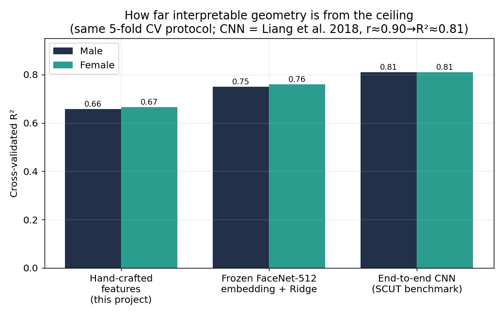
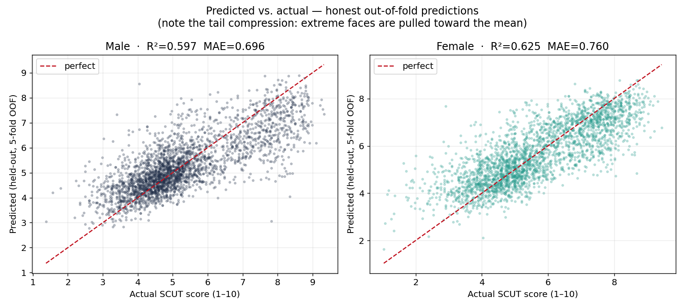
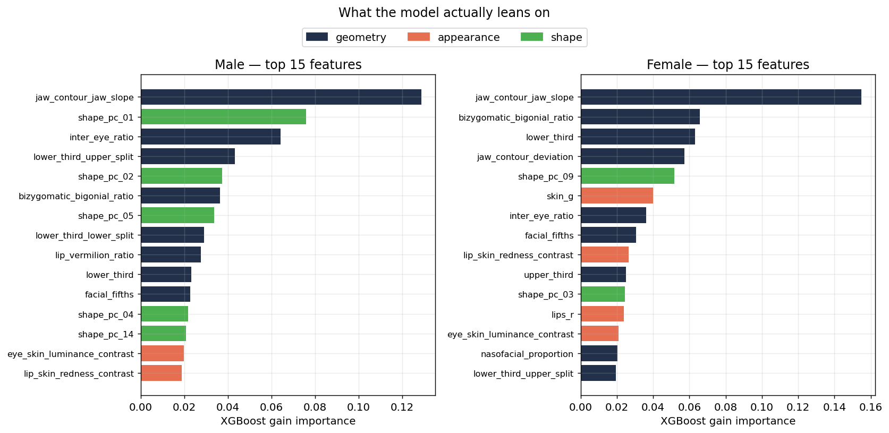
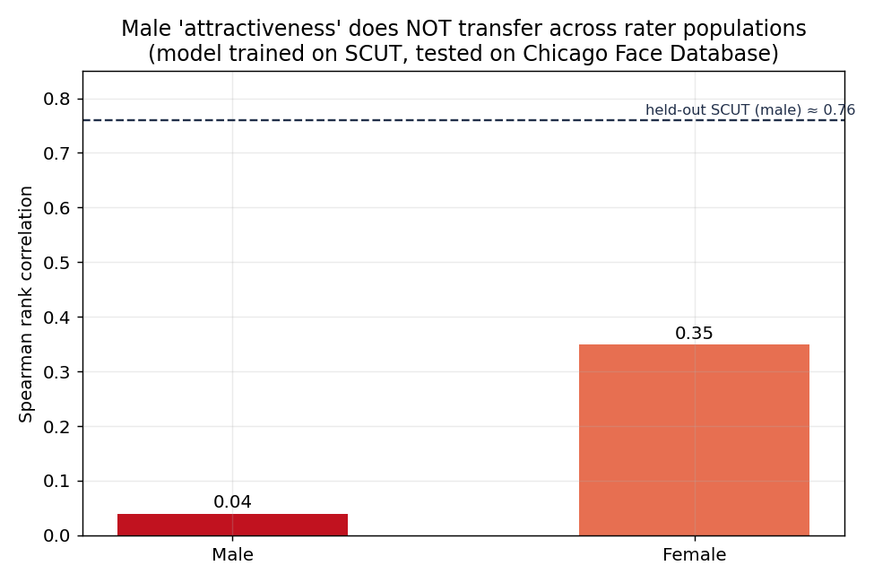
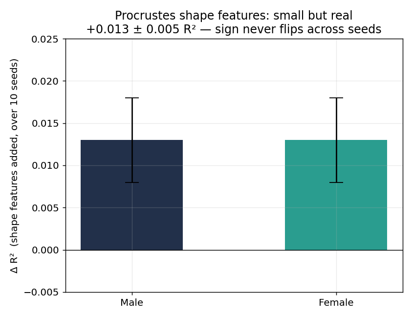
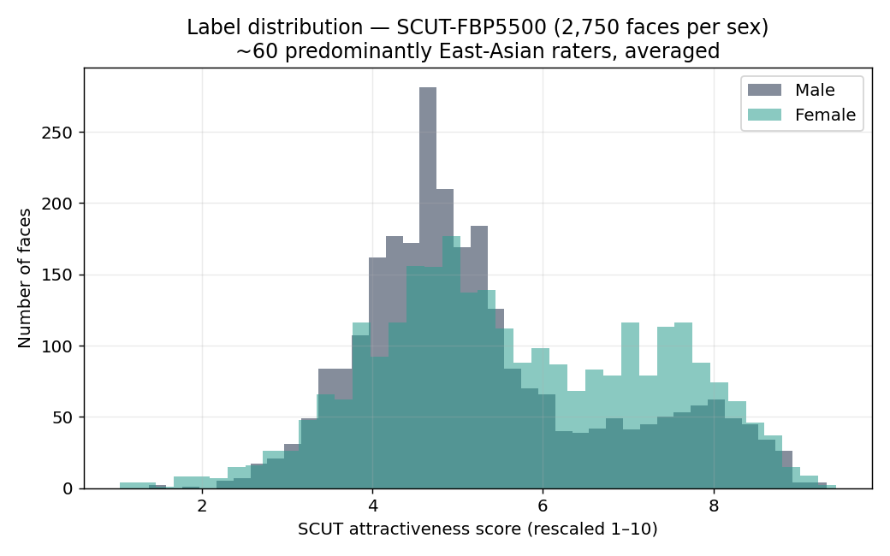

# Odin — Facial Geometry & Attractiveness-Modeling Study

A personal project exploring **facial geometry** — the proportions and ratios cited
in facial-aesthetics literature — and, as a modeling exercise, **how well (and how
poorly) those features predict the subjective attractiveness ratings of a specific
research dataset**. It extracts 478 facial landmarks with MediaPipe, computes ~25
classical ratios plus colour/texture and Procrustes shape features, and trains
gradient-boosted models on the SCUT-FBP5500 dataset.

> ⚠️ **This is not a tool for measuring human attractiveness.**
> The output is **NOT** a meaningful, objective, or authoritative judgment of
> anyone's appearance, and should NOT be treated as one. The "score" only
> reflects the **averaged opinions of the ~60 raters** who labelled the
> SCUT-FBP5500 dataset (predominantly East-Asian faces) — it is one narrow,
> culturally specific snapshot of taste, not a standard. I built this out of
> genuine interest in facial geometry and to map, for myself, *what actually
> drives a "beauty" rating and what doesn't*. **Please don't base your
> self-image on anything here.**

## What this project is really about

The interesting question was never "what's the score" — it was: *can hand-crafted
geometric ratios explain attractiveness ratings at all, and where do they hit a
wall?* Treating it as an honest ML investigation produced clearer findings than the
predictor itself:

- **Geometry explains ~66% of the rating variance — and the *features*, not the
  model, set that ceiling.** Cross-validated R² reaches **0.657 (male) / 0.666
  (female)** once shape is captured with supervised **PLS** axes; the rest is
  skin/texture/gestalt landmark geometry cannot see. Bigger models and tuning never
  moved it — but *better features* did: PCA→PLS shape alone added +0.03–0.04 R².
- **"Attractiveness" doesn't transfer across rater populations for male faces.**
  A model trained on SCUT ranks held-out SCUT males well (Spearman ≈ 0.76) but
  ranks a different population's male faces (CFD) at **≈ 0.04 — essentially
  random.** For female faces it transfers moderately (≈ 0.35). In other words,
  *male* "attractiveness" as labelled here is highly population-specific.
- **Model choice matters in a teachable way.** A RandomForest, being a
  leaf-averaging model, regresses the tails toward the crowd mean (it literally
  can't rate an 8/10 face as an 8) — so it was dropped in favour of **XGBoost**,
  whose boosting follows the full curve.
- **Supervised shape (PLS) is the single biggest lever.** Swapping unsupervised
  shape-PCA for **PLS** — which orients each shape axis toward the *rating* rather
  than toward raw variance — roughly doubles what geometry contributes. The
  Procrustes features (averageness + 25 PLS axes) add **+0.044 (female) / +0.065
  (male) R²** over the ratios alone (10-seed OOF), of which ~+0.03 is PLS beating
  PCA at the same axis count. It lifts honest 5-fold CV to **0.666 / 0.657**, and
  for males a *single* PLS axis — jaw angularity × face width-to-height — becomes
  the model's #1 feature. Interpretability is preserved: every axis is still a
  plottable deformation mode, now labelled by the shape change most tied to the score.
- **Hand-crafted skin descriptors barely move the needle.** To test whether the
  "skin quality" part of the ceiling gap is recoverable *by design*, I added
  colour-unevenness (CIELab a\*/b\* spread → pigmentation/blotchiness) and a
  band-pass blemish detector. Under the same 10-seed paired ablation they add only
  **+0.006 (female) / +0.005 (male) R²** — a real lift (the sign holds), but
  negligible, and for males the seed-to-seed spread is about as large as the effect
  itself. The takeaway is the interesting part: the gap to a deep embedding is
  **not** mostly nameable skin texture waiting to be measured — it's un-interpretable
  gestalt.
- **Interpretable geometry now leaves only ~0.08–0.09 R² vs. a deep embedding.** A
  frozen FaceNet-512 embedding + Ridge reaches ~0.75 R² and the deep-CNN benchmark
  ~0.81, while the hand-crafted PLS model reaches **~0.66** (see *How far this is
  from the ceiling* below). What remains is un-interpretable gestalt and
  photographic confounds — the hand-crafted model trades that last sliver for
  explanations you can actually read.

I think the limitations are the most valuable part — they're documented here on
purpose.

## Results

All figures are aggregate statistics (no face images), reproducible with
`python plots/generate_plots.py`.

**Where interpretable geometry sits vs. the ceiling.** Hand-crafted features reach
~0.66 R²; a frozen FaceNet-512 embedding ~0.75; the deep-CNN benchmark ~0.81. I
measured my own ceiling instead of guessing it.



**How the model behaves — honest out-of-fold predictions.** Note the *tail
compression*: extreme faces are pulled toward the mean, because hand-crafted
features can't confidently place a 2 or a 9. This is worse in RandomForest (why it
was dropped).



**What the model leans on.** Top-15 features per sex, coloured by group — geometry
dominates, with Procrustes shape and colour/texture contributing.



**The bias finding: male "attractiveness" doesn't transfer across rater
populations.** Trained on SCUT, the model ranks held-out SCUT males at Spearman
≈0.76 but a different population's males (CFD) at ≈0.04 — essentially random.
Females transfer moderately (≈0.35).



**Supervised shape (PLS) is the biggest lever, verified across seeds.** Procrustes
averageness + shape-PLS add **+0.044 (female) / +0.065 (male) R²** over the ratios
(10-seed OOF), of which ~+0.03 is PLS beating PCA at the same axis count — the sign
never flips.



**The data.** SCUT-FBP5500 label distribution, 2,750 faces per sex, averaged over
~60 predominantly East-Asian raters.



## How it works

```
photo ──► MediaPipe FaceLandmarker (478 landmarks)
      ──► geometric ratios   (thirds, fifths, golden, FWHR, jaw, EAR, …)
      ──► appearance         (skin texture + colour-unevenness + blemish, lip/eye/skin colour, CIELab contrasts)
      ──► Procrustes shape   (averageness + 25 shape-PLS axes, oriented toward the rating)
      ──► XGBoost regressor  ──► 1–10 score (+ optional male presentation boost)
```

Geometric ratios are scale-invariant; the colour/texture and shape features use
pixel-space landmarks. Models are trained per sex and bundled with their feature
order and shape basis so inference reproduces the exact feature vector.

## Project structure

```
Odin/                      # inference pipeline: image → features → score
├── main.py                #   orchestration, build_features(), male_boost()
└── Face_analysis/
    ├── landmarks.py       #   MediaPipe Tasks landmark extraction
    ├── face_data.py       #   478 raw points → named semantic points
    ├── constants.py       #   config, feature/boost constants
    ├── utils.py           #   angle helpers
    └── Ratios/
        ├── calculate_ratios.py   # the classical geometric ratios
        ├── appearance.py         # colour / texture / CIELab contrast
        ├── regions.py            # sampling polygons (lips/eyes/cheeks/forehead)
        └── shape.py              # Procrustes alignment + shape features
odin_ui/                   # web UI (upload a photo → landmarks overlay + ratios + score)
├── backend/  app.py       #   FastAPI wrapper around the exact Odin pipeline
└── frontend/              #   Vite + React + TypeScript
odin_model/                # training side (datasets NOT included — see below)
├── data_scut.py           #   SCUT feature extraction → CSV cache
├── extract_landmarks.py   #   one-time raw-landmark cache (for shape features)
├── shape_utils.py         #   GPA + shape-PLS fitting
├── train.py               #   XGBoost training, CV, bundle export
└── overlay.py             #   debug region overlays
models/                    # trained artifacts
├── model_male.joblib      #   XGBoost bundle (male)
├── model_female.joblib    #   XGBoost bundle (female)
└── face_landmarker.task   #   MediaPipe model (download separately, see below)
```

## Requirements

- **Python 3.10+**
- Inference: `mediapipe`, `opencv-python`, `numpy`, `pandas`, `scikit-learn`,
  `xgboost`, `scipy`, `joblib`
- Web UI backend: `fastapi`, `uvicorn`, `python-multipart`
- Web UI frontend: **Node.js + npm**
- Training (`odin_model`): the above + `matplotlib`, `seaborn`, `tqdm`, `openpyxl`

## Installation & usage

```bash
pip install -r requirements.txt
```

Download the MediaPipe face landmarker model into `models/`:
<https://storage.googleapis.com/mediapipe-models/face_landmarker/face_landmarker/float16/1/face_landmarker.task>

**CLI** — set `IMAGEPATH` and `SEX` in `Odin/Face_analysis/constants.py`, then:
```bash
python -m Odin.main
# → Attractiveness (MALE): 7.64 / 10
```

**Web UI** — run the two pieces:
```bash
# backend (uses the same env as the CLI)
cd odin_ui/backend && pip install -r requirements.txt
uvicorn app:app --reload --port 8000

# frontend (new terminal)
cd odin_ui/frontend && npm install && npm run dev   # open http://localhost:5173
```
Upload a face photo → it returns the photo with the landmark overlay, the
calculated ratios (hover a ratio to highlight the landmarks it uses, with the
male/female ideal beside it), and the model score.

**Training** (optional, requires the SCUT dataset placed under `odin_model/scut/`):
```bash
cd odin_model
python extract_landmarks.py   # one-time landmark cache
python train.py               # → 69-feature bundles in models/
```

## Data & ethics

The SCUT-FBP5500 dataset (and CFD, used briefly during the population-transfer
analysis) are **not included** in this repository — they are photographs of real
people under their own academic-use terms, and redistributing them would be a
licensing and privacy violation. Only code is published; obtain the datasets from
their original sources if you want to retrain. The ratings are subjective human
judgments from a specific, non-representative rater pool — see the disclaimer.

## Dataset citations

These datasets require citation. If you retrain or build on this work, cite their
original authors.

**SCUT-FBP5500** — primary training data:

> Liang, L., Lin, L., Jin, L., Xie, D., & Li, M. (2018). SCUT-FBP5500: A Diverse
> Benchmark Dataset for Multi-Paradigm Facial Beauty Prediction. *2018 24th
> International Conference on Pattern Recognition (ICPR)*, 1598–1603.
> https://doi.org/10.1109/ICPR.2018.8546038

```bibtex
@inproceedings{liang2018scutfbp5500,
  title        = {{SCUT-FBP5500}: A Diverse Benchmark Dataset for Multi-Paradigm Facial Beauty Prediction},
  author       = {Liang, Lingyu and Lin, Luojun and Jin, Lianwen and Xie, Duorui and Li, Mengru},
  booktitle    = {2018 24th International Conference on Pattern Recognition (ICPR)},
  pages        = {1598--1603},
  year         = {2018},
  organization = {IEEE},
  doi          = {10.1109/ICPR.2018.8546038}
}
```

**Chicago Face Database (CFD)** — used only for the cross-population transfer
analysis (not shipped, not part of the trained models). Per the CFD usage terms,
cite the set(s) used:

> CFD: Ma, D. S., Correll, J., & Wittenbrink, B. (2015). The Chicago Face Database:
> A Free Stimulus Set of Faces and Norming Data. *Behavior Research Methods, 47*,
> 1122–1135. https://doi.org/10.3758/s13428-014-0532-5
>
> CFD-INDIA: Lakshmi, A., Wittenbrink, B., Correll, J., & Ma, D. S. (2021). The
> India Face Set: International and Cultural Boundaries Impact Face Impressions and
> Perceptions of Category Membership. *Frontiers in Psychology, 12*, 627678.
> https://doi.org/10.3389/fpsyg.2021.627678
>
> CFD-MR (if you use the multiracial expansion): Ma, D. S., Kantner, J., &
> Wittenbrink, B. (2021). Chicago Face Database: Multiracial Expansion. *Behavior
> Research Methods, 53*, 1289–1300. https://doi.org/10.3758/s13428-020-01482-5

## Model performance

Trained on **SCUT-FBP5500** (2,750 faces per sex), 69 features, scored with
**5-fold cross-validation** (held-out, not training-fit). The shape model (PLS) is
refit on each fold's train split, so the numbers are leakage-free:

| Model | MAE | RMSE | R² |
|-------|-----|------|-----|
| Female | 0.718 | 0.928 | 0.666 ± 0.018 |
| Male (raw XGBoost) | 0.632 | 0.854 | 0.657 ± 0.019 |

The labels are on a 1–10 scale (rescaled from SCUT's 1–5). For context, divide MAE
by 2.25 to compare with the deep-CNN SCUT literature (≈ 0.22 MAE on 1–5): these
hand-crafted-feature models sit at the top of the *classical/interpretable* range,
below end-to-end CNNs — expected, since they use hand-built ratios + shape instead
of raw pixels.

A male-only **presentation boost** can stretch above-mean scores toward a more
intuitive scale; it intentionally trades fit against SCUT's own raters, so it is a
display choice, not an accuracy improvement.

## How far this is from the ceiling

To see how much attractiveness signal is even *recoverable* from a face image — and
how much of it the interpretable features capture — I compared three approaches
under the **same 5-fold CV protocol** (1–10 scale):

| Approach | Male R² | Female R² | What it captures |
|----------|---------|-----------|------------------|
| Hand-crafted features (this project) | 0.657 | 0.666 | interpretable geometry + colour + PLS shape |
| Frozen FaceNet-512 embedding + Ridge | 0.749 | 0.759 | signal in a face-recognition embedding |
| End-to-end CNN (SCUT-FBP5500 benchmark) | ≈ 0.81 | ≈ 0.81 | the full-image ceiling |

The CNN figure is the official **SCUT-FBP5500 benchmark** (Liang et al., 2018; see
*Dataset citations*): its best model, **ResNeXt-50**, reports a **Pearson
correlation ≈ 0.90** (so ≈ 0.81 R²) with **MAE ≈ 0.21** on the 1–5 scale under
5-fold CV. That benchmark trains on all 5,500 faces **pooled** (not per sex), so
treat ≈ 0.81 as a rough ceiling reference, not a like-for-like number.

How to read it:

- A **frozen identity embedding** — no fine-tuning at all — already recovers
  ~**0.75 R²**, about **94% of the deep-CNN ceiling**. Most of the extractable
  signal lives in a generic face representation, not in attractiveness-specific
  training.
- The **interpretable features now leave only ~0.08–0.09 R²** relative to that
  embedding — down from ~0.14 once shape moved from PCA to **PLS** (supervised shape
  axes, +0.03–0.04 R²). What's left resisted hand-crafting: adding skin
  colour-unevenness and blemish descriptors closed only **~0.005** of it. So the
  residual gap is mostly holistic "gestalt" geometry and photographic confounds that
  **don't reduce to nameable features**, not unmeasured skin quality — and the
  realistic *explainable* ceiling has climbed to **~0.66**, close to what a frozen
  identity embedding gets.
- **PLS shape closed the male gap.** Supervised shape helped males most (+0.065 vs
  +0.044 R²), so both sexes now sit almost level against the embedding (~0.09 gap
  each), where PCA-era male geometry had trailed. That fits the earlier finding that
  male attractiveness leans harder on geometry — geometry the *right* shape features
  can finally capture.

## Importing the model into another project

The `.joblib` bundle is **not** self-contained: a prediction is only valid if the
69 input features are produced by this exact pipeline (same landmarks, pixel
scaling, ratio definitions, shape basis, and column order). Copy the feature code
with the model — `Odin/` (the whole package) + `models/` — not just the bundle.

**Each bundle is a dict:** `xgboost`, `feature_names` (required column order),
`label`, `target`, `n_samples`, male calibration stats `xgb_pred_mean` /
`xgb_pred_max`, and the shape model `shape_ref_mean` / `shape_pls` (a fitted
`PLSRegression`; older bundles carry `shape_pca` instead).

**Minimal usage** (from the project root):
```python
import joblib, pandas as pd
from Odin.Face_analysis.landmarks import calculate_landmarks_array
from Odin.Face_analysis.face_data import extract_face_data
from Odin.Face_analysis.Ratios.appearance import appearance_features
from Odin.main import build_features, add_shape_features, male_boost

landmarks, img = calculate_landmarks_array("photo.jpg")
h, w = img.shape[:2]
px = landmarks.copy(); px[:, 0] *= w; px[:, 1] *= h; px[:, 2] *= w  # pixel space

model = joblib.load("models/model_male.joblib")
features = build_features(extract_face_data(px), appearance_features(img, px))
add_shape_features(features, px, model)               # adds the Procrustes features
X = pd.DataFrame([features], columns=model["feature_names"])

score = float(model["xgboost"].predict(X)[0])
if model["label"] == "MALE":                          # male-only presentation boost
    score = male_boost(score, model)
print(round(score, 2))
```

## License

See `LICENSE`. Note that a licence governs reuse of this **code**; the underlying
ratios are drawn from public facial-aesthetics literature and are not themselves
owned by this project.
